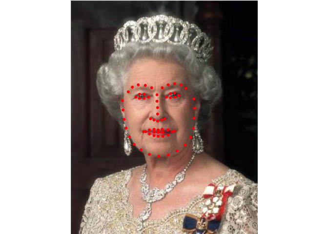

`faceplyr`: Tools to work with faces in R
================

# `faceplyr` 

# Motivation

My motivation is primarily selfish. I wanted to work mostly in the R
environment and have R code that performed like I would expect R to
perform, but with the performance and breadth of a few Python image
functions I wish R had natively. In a similar vein, I found myself
loading multiple R image libraries to perform a set of operations on one
image. A single package that brought all of this together under one
convenient roof was the main motivating factor for writing this package.

This project started as part of my first “real” R package many years
ago, so it is messy. Really messy. I’ve learned a lot since I started
writing this package, and I have hopes of cleaning it up and reducing
dependencies in the future (see `TODOs`). However, as a scientist and
not a developer, my main motivation was to get the code I wanted to work
rather than preform elegantly.

# Disclaimer

This package is very much a work in progress and is by no means meant
for heavy production use. It started as a private repository of
functions that I used regularly in daily work and research. As such,
there are many package dependencies that make `faceplyr` quite large and
cumbersome. Hopefully in the future I will have to time to parse some of
these dependencies. A lot of the “fluff” is because I wanted things to
be easy and readable on my end (e.g., `tidyverse`), or look pretty
(`cli`), both of which are not good reasons to include in a codebase.
However, these don’t influence functionality and can ultimately be
stripped out in the future.

Be aware that there are also bits and pieces of unfinished code for
functions/data that I am either currently working with, or for functions
that are still being tested.

If a function currently will not run, there is a good chance that I
missed importing a package when I built and evaluated `faceplyr`. It
would be wise to pre-install following packages and pre-load a subset of
them when using `faceplyr` just to be safe:

``` r
paks <- c("tidyverse", "fs", "imager", "magick", "reticulate", "raster", "cli", "glue")
install.packages(paks)

if (!requireNamespace("BiocManager", quietly = TRUE))
    install.packages("BiocManager")

BiocManager::install("EBImage")

library(tidyverse)
```

Why are there multiple image handling libraries needed? Because they all
do different things, and no one library has all the specific image
handling functions needed.

This package has been tested and works on MacOS and Ubuntu Linux.

## Quick start

You need to have conda installed with a `faceplyr` environment for this
package to work properly. `reticulate` provides a helper function to
download and install miniconda, as well as setup an environment.
`faceplyr` also has a `requirements.txt` file so that you can
`pip install` the minimum python requirements.

If these are already satisfied (see below) using `faceplyr` should be as
simple as:

``` r
# install.packages("remotes")
# remotes::install_github("d-bohn/faceplyr")

library(faceplyr)

reticulate::use_condaenv("faceplyr", required = TRUE)
```

## Setup Conda

If you don’t have Miniconda or Anaconda already on your machine, you
will have to install if first in order to work with `faceplyr`. Conda is
a package manager mostly used for Python, but it is extendable to other
programs. `reticulate` has helper functions for doing this easily. You
can name the environment whatever you want, but you just need to
remember to activate that specific environment whenever you want to use
the package.

``` r
reticulate::install_miniconda()
reticulate::conda_create(envname = "faceplyr")
```

Next, or if you already have Conda on your machine, you need to setup an
environment for `faceplyr`. The `requirements.txt` outlines which python
packages are necessary for making the code in `faceplyr` perform.
Several functions in `faceplyr` either call external Python code, or are
wrappers around already established and vetted code.

``` r
requirements <- read.system.file("extdata", "requirements.txt", package = "faceplyr")

reticulate::conda_install(
  envname = "faceplyr",
  pip = TRUE,
  pip_options = glue::glue("install -r {requirements}")
)

faceplyr::install_opencv() # Only conda install is supported and only tested on Mac
```

On UNIX systems there is a helper function (`conda_install_faceplyr`) to
bypass the necessity of setting up an environment and the required
packages. If you run `R` on Mac or Linux the requirements for this
package can mostly be installed via:

``` r
conda_install_faceplyr(pyV="3.8")
```

This function should return `TRUE` if all goes smoothly. If all else
fails (or you’re on Windows) you can install the `Docker` image from the
`Dockerfile` in this repository (TBD: `Dockerfile`).

# Examples

## Extract face metrics

Let’s say we want to extract several metrics from this (included) image:


All of the `extract_*` functions require as input the interior cropped
face as a PNG file (to maintain an alpha channel). You can manually do
so with some helper functions and pass the saved cropped image to each
function, but the variable names expect the *unaltered* image name as
the `image` parameter. This was done to encourage running the
`extract_*` functions in a certain order starting with
`extract_structure`. After `extract_structure` is run, the other
`extract_*` functions can be run in any order. The structure metric is
the most important because it does the heavy lifting of locating the
face in the image and cropping out the area of interest. If I didn’t
specify running this function first, every other function written (both
currently in the future) would have to call `extract_structure` before
it could continue. It is easier for the time being to just run
`extract_structure` first.

``` r
image <- system.file("extdata", "queen.png", package = "faceplyr")

extract_structure(image = image, data_save_folder = "./output", return_results = FALSE)

# → Image complete (structure): ./output/queen_cropped.png
```

The above code should result in the image saved to
`./output/queen_cropped.png`:


Notice that a `data_save_folder` was specified and `return_results` was
set to `FALSE`. This combination will save a `RDS` file to the
`./output` folder on your machine where the results from the structure
metric function will be written. Alternatively, you can specify
`return_results` and it will instead return the output to the console
(or an object) and `data_save_folder` will be ignored for saving data,
but still needed to save the cropped image.

We can see how well `dlib` did at finding the face metric point
locations with the `plot_landmarks` helper function:

``` r
plot_landmarks(image = system.file("extdata", "queen.png", package = "faceplyr"))
```



After running `extract_structure` on an image all of the other
`extract_*` functions should auto-*magically* work on the same image.

``` r
extract_hist_colors(image = image, data_save_folder = "./output")

# → Image complete (color hist): ./output/queen_cropped.png
```

# TODO List

There are a number of “wish list” items that I want to implement in this
package. Here is a running list:

-   Switch to building openCV from source (for RVision) and link to
    conda

    -   See `./R/install_opencv_source.R` for details (can build from
        source, but trouble linking it to conda env)
    -   Remove requirement for `opencv-python`

-   ~~Switch feature saving from `.RDS` to SQLite `.db`~~ Complete
    03/23/21

    -   ~~Allows for everything (sans actual images) to be stored in a
        single database that’s cross platform and program (e.g., read
        into python easily)~~

-   Option to store and retrieve images stored as base64 in SQLite db

-   Create `Dockerfile` for easy install on host machines

    -   Major priority

-   Reduce overall dependencies

    -   Create “in house” facial landmark classifier to reduce
        dependencies and speedup landmarking
        -   Major priority

-   Cleanup `.R` files

    -   ~~Simplify `read_landmarks()`~~ Complete 03/25/21

-   Cleanup `legacy`, `devel`, and unused Python files in `inst`

-   Switch from `S3` to `R6`/`R7`?:

    -   `read_landmarks()`? (to add read, write, and plot methods to one
        class/object)
    -   sct `extract_*` functions? (Could call action and side effects
        easily)

-   Estimate new features/metrics

    -   ~~Facial roundness (e.g., `faceplyr::extract_roundness`, but
        see, `faceplyr::calc_roundness`)~~ Complete 02/xx/21
    -   ~~Facial angularity (e.g., `faceplyr::extract_angularity`)~~
        Complete 02/xx/21
    -   Face wrinkles/skin marks
    -   Expansion/Constriction
